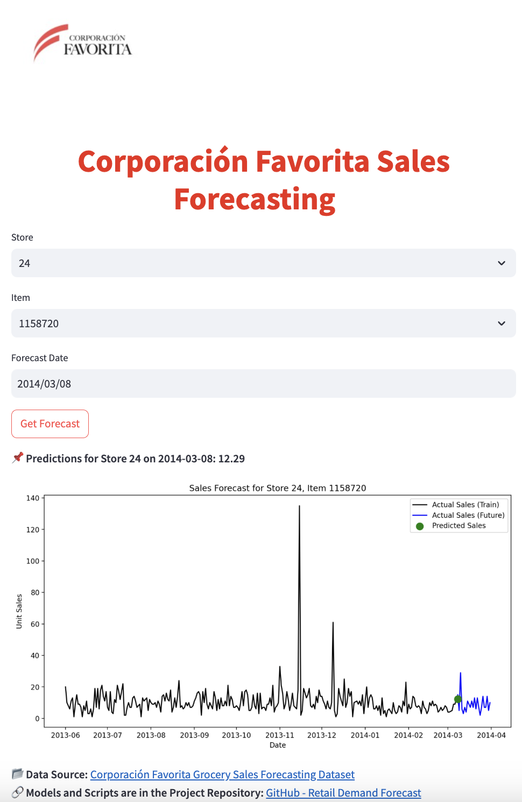

# Retail Demand Forecast for Corporación Favorita
#### Project used in the AdvancedML Time-Series cource at Masterschool
## **📌 Project Overview**
Corporación Favorita, a major Ecuadorian retailer, requires accurate demand forecasting to optimize inventory management and supply chain efficiency. This project leverages **machine learning** and **time series forecasting techniques** to predict sales across multiple stores and products.

## **🔹 Project Result: Streamlit Forecasting App**
This project includes an **interactive Streamlit application** that allows users to forecast sales by selecting:
- **Store**
- **Item**
- **Forecast Date**

Once parameters are entered, the app provides a **predicted sales value** along with a visualization of historical sales and future predictions.

📌 **Key Feature:**  

Unlike the original dataset’s forecasting task (limited to the period **01.01.2014 – 31.03.2014**), my approach allows for **extended forecasting beyond this period**, making it more applicable for real-world business decisions.



---


### **🔹 Final Model Selection**
After testing multiple models, **XGBoost was selected as the most accurate and efficient** for this task. The **Streamlit app is powered by XGBoost predictions**.

Although other models were explored, **XGBoost demonstrated superior performance**, making it the ideal choice for deployment.

### **🔹 Models Tested**
- ✅ **XGBoost (Final Model - Deployed in Streamlit App)**
- ARIMA (AutoRegressive Integrated Moving Average)
- LSTM (Long Short-Term Memory)
- Prophet (Facebook’s Prophet)
- SARIMAX (Seasonal AutoRegressive Integrated Moving-Average with eXogenous variables)

✅ **Why XGBoost?**
- **Best overall performance** in terms of accuracy and stability.
- **Handles large-scale time-series data efficiently**.
- **Works well with feature-engineered data**, capturing complex demand patterns.

Performance metrics and model evaluations were **tracked using MLflow**, and detailed results can be found in the corresponding notebooks

---

## 📂 **Project Structure**
```
retail_demand_forecast/
│-- app/ # Streamlit application files
│ ├── main.py # Streamlit app script
│ ├── config.py # Paths and configurations
│-- data/ # Raw dataset files
│-- inputs/ # Preprocessed input data
│-- model/ # Trained models
│-- models/ # Additional trained models and experiments
│-- notebooks/ # Jupyter Notebooks for EDA and model training
│-- outputs/ # Forecast outputs and visualizations
│-- report/ # Final reports and analysis
│-- venv/ # Virtual environment (should be excluded from GitHub)
│-- LICENSE # License information
│-- README.md # Project documentation
│-- debug_input_data.csv # Sample input data for debugging
│-- requirements.txt # Dependency list
```

---

## 📊 **Data Source**
The dataset used for this project is derived from the publicly available **["Corporación Favorita Grocery Sales Forecasting"](https://www.kaggle.com/competitions/favorita-grocery-sales-forecasting/data) dataset on Kaggle**.

---

## 🏬 **Data Filtering Strategy**
To ensure a focused and efficient analysis, we applied the following **filtering strategy**:

- **Region:** Stores in the state of **Guayas**.
- **Products:** Two representative items (**106716**, **1158720**).
- **Date Range:** Data **before April 1, 2014**.

### **Filtering Process**
- The dataset was processed in **chunks** to optimize memory usage.
- Data was **filtered based on store locations, item numbers, and date constraints**.
- The processed dataset was **aggregated into a time-series view** of unit sales per product.

---

# 🚀 **Installation & Setup**
## Clone the Repository**
```sh
git clone https://github.com/Kovalivska/retail_demand_forecast.git
cd retail_demand_forecast
```
## Install Dependencies
```python
pip install -r requirements.txt
```

## Run the Streamlit App
```python
streamlit run app/main.py
```

📌 Author

👩‍💻 Svitlana Kovalivska, PhD

📅 Last Updated: March 12, 2025


